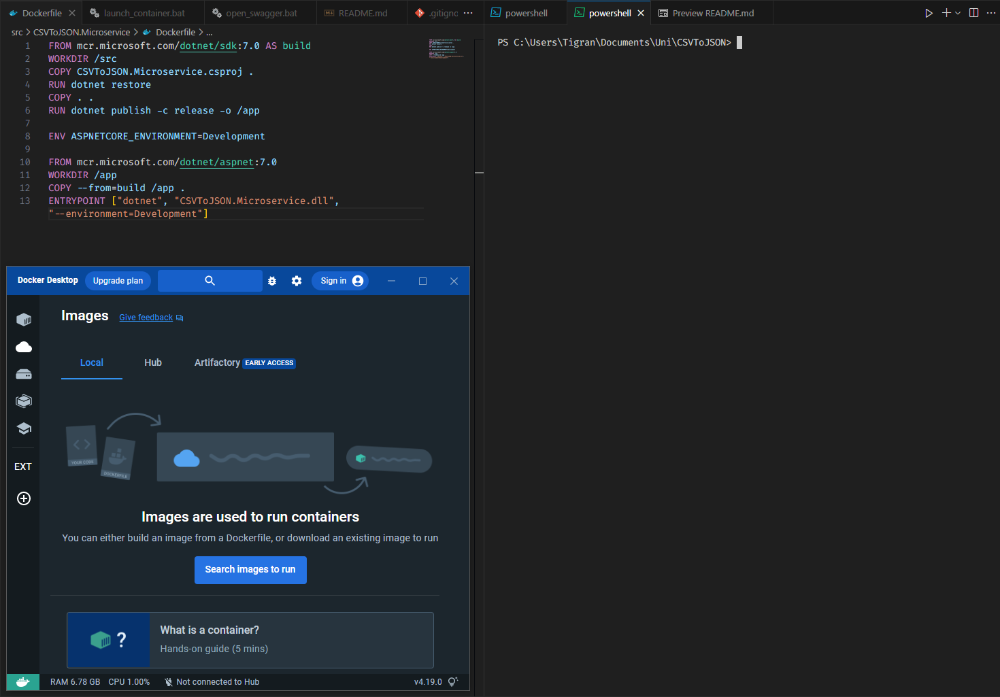
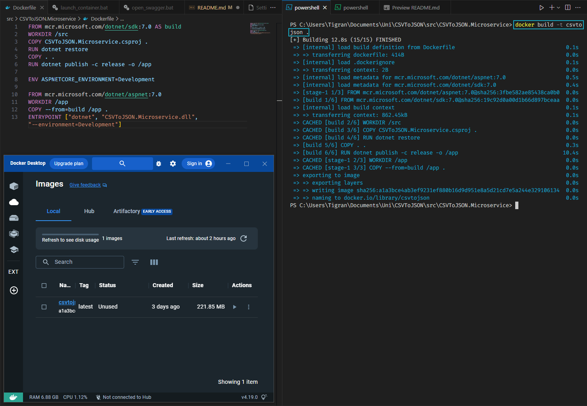
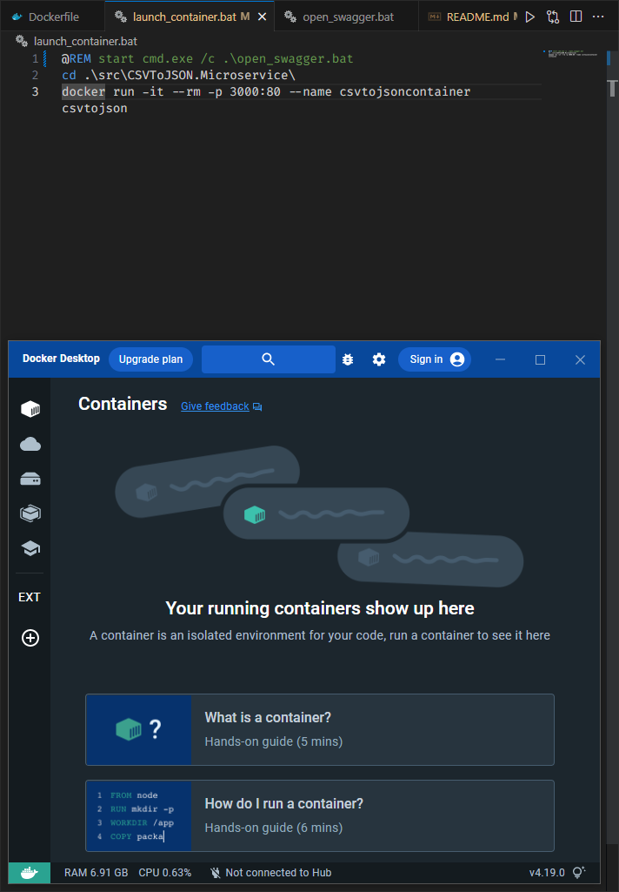
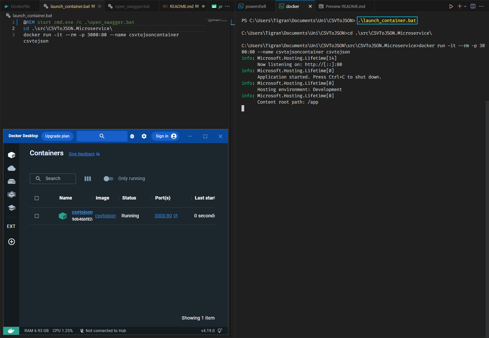
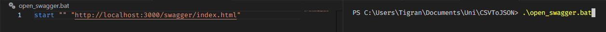
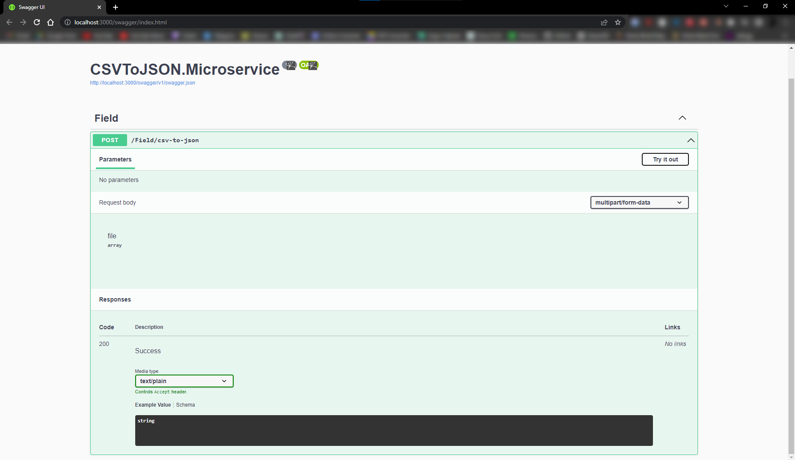
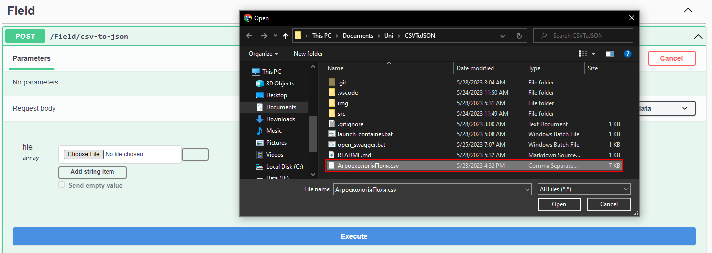
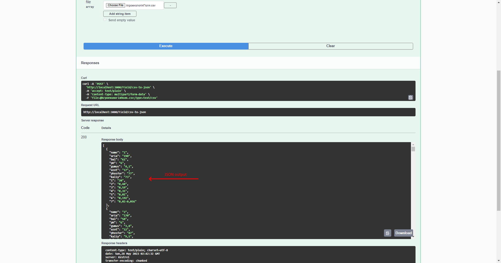

# Microservice: Компоненти Програмної Інженерії 3

## Let's explore the creation and usage of our Microservice on a Docker container
----
1. ### Docker ***image*** has not been created yet, Docker ***file*** is ready



2. ### Running the ```docker build -t csvtojson .``` command



3. ### Docker ***container*** has not been created yet.



4. ### `launch_container.bat` is a small batch script that will automatically create a docker image



5. ### `open_swagger.bat` is a small batch script that will automatically open swagger UI on the running container for the microservice 


6. ### Swagger UI allows for easy testing of HTTP requests to the Microservice


7. ### Press **Try it out** and upload the csv file, then press **Execute** to send the request to the service



8. ### The *Response body* contains output JSON file and can be downloaded


